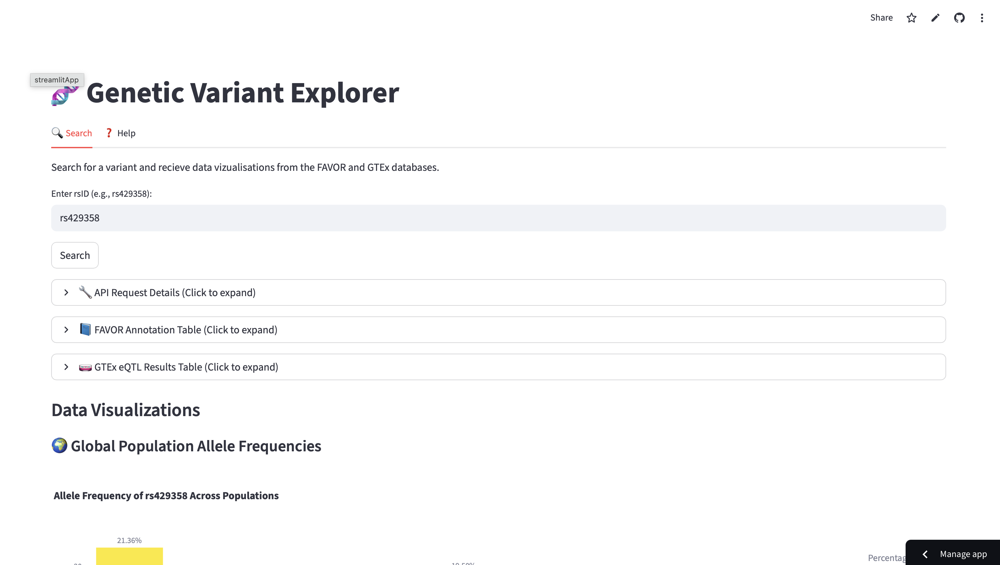

## Genetic Variant Explorer
Try the app: https://wang-lab-api-takehome.streamlit.app/

Video Demo: Check Github Releases



## APIs

This app integrates three genomics APIs:

### FAVOR (Functional Annotation of Variants Online Resource)
Aggregates 50+ annotation tracks including pathogenicity predictors, conservation scores, and population frequencies.

| Endpoint | Method | Description |
|----------|--------|-------------|
| `https://api.genohub.org/v1/rsids/{rsid}` | GET | Retrieve functional annotations by rsID |

**Key fields returned:** CADD, SIFT, PolyPhen2, AlphaMissense, ClinVar significance, gnomAD population frequencies

**Source:** [Harvard T.H Chan School of Public Health](https://favor.genohub.org/)

---

### GTEx (Genotype-Tissue Expression)
Expression quantitative trait loci (eQTL) data across 54 human tissues from ~1,000 donors.

| Endpoint | Method | Description |
|----------|--------|-------------|
| `https://gtexportal.org/api/v2/dataset/variant` | GET | Convert rsID → GTEx variantId |
| `https://gtexportal.org/api/v2/association/singleTissueEqtl` | GET | Fetch eQTL associations |

**Source:** [Broad Institute of MIT and Harvard](https://gtexportal.org/home/aboutAdultGtex)

Visualisations
1. Global Population Allele Frequencies
2. Functional Annotation Landscape
3. eQTL Heatmap

The motivation for these visualizations is to follow a logical progression from descriptive epidemiology to predicted function and finally to empirical mechanism.

### How to start once the repo is cloned

```bash
python3 -m venv .venv
source .venv/bin/activate
pip install -r requirements.txt
streamlit run src/app.py
```

## Run Tests
```bash
pytest -v
```
